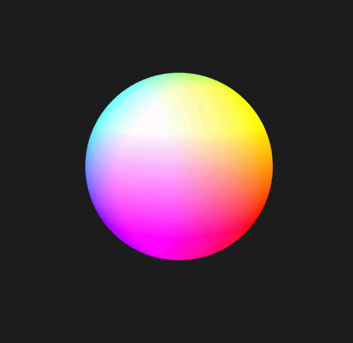

# Raw GPU power with shaders in three.js

It is time to unleash the christmas spirit hiding behind that noisy fan in your computer. In this article, we will use shaders in WebGL to make animations no one could imagine in JavaScript before.  

All good developers will get presents from Santa. So I am absolutely sure that you have read the previous calendar entry [https://javascript.christmas/2020/9](3D with WebGL and three.js). Although, if you have dabbled in WebGL before, that is not strictly necessary.

## A shady proposal

The best thing about shaders is the unlimited supply of puns around the word shader. They are small programs written to be executed for every point and every pixel on the screen. 

Every 3D game you play is made up of many three-pointed polygons that are rendered onto the pixels on your display monitor. The position of all the points, and the color of all the pixels, are the output values of these shaders.

`three.js` comes with default shaders that cover the most basic use cases. But we are not basic, are we? No, we are special! To write our own shaders we simply replace each material with a special `ShaderMaterial`:

```javascript
const material = new THREE.ShaderMaterial({
    uniforms,
    vertexShader: vertexShaderCode,
    fragmentShader: fragmentShaderCode
});
```

These are the parameters:

- `uniforms`: A record of global variables passed from the JavaScript code to the shader code. Useful for passing things like time, light positions or texture images
- `vertexShader`: The shader program (string) to be run once for every point in all the polygons
- `fragmentShader`: The shader program (string) to be run once for every pixel that make up those polygons

We are going to make a sphere that wobbles when we press it. This is our shady proposal! We start with a sphere with diameter of 1, consisting of 128 times 256 facets. Like a disco ball!

```javascript
const geometry = new THREE.SphereGeometry(1, 128, 256)
```

This is added to the scene just like any other stuff:

```javascript
const mesh = new THREE.Mesh(geometry, material);
scene.add(mesh);
```

Now it will be rendered to the screen, but it won't work of course, because we have to define the uniforms and shader code!

The uniforms are simply a JavaScript object with entries for each variable. I am going to use `time` to track the neverending passing of time (in seconds). And then I am going to have the clever little `animationTime` to control the wobble animation, where `0.0` is the start and `1.0` is the end:

```javascript
const uniforms = {
    time: { value: 0.0 },
    animationTime: { value: 1.0 },
};
```

I will update these uniforms for every rendered frame:

```javascript
let animationTime = 1;

function animate() {
    requestAnimationFrame(animate);

    updateTime();
    
    uniforms.time.value = time;
    uniforms.animationTime.value = animationTime;

    renderer.render(scene, camera);
}

document.addEventListener("click", () => { animationTime = 0 }); 
```

## Check out these shades

That was all pretty much boilerplate, if you ask me! Now we are ready for the actual shader code. It is written in GL Shading Language, which is very close to our old pal C. This is the vertex shader code:

```glsl
uniform float time;
uniform float animationTime;

vec3 modifyPosition(vec3 startPosition) {
    // Calculate offset

    return startPosition + offset;
}

void main() {
  vec3 modifiedPosition = modifyPosition(position);

  vec4 modelSpaceCoordinates = vec4(modifiedPosition, 1.0);
  vec4 worldSpaceCoordinates = modelMatrix * modelSpaceCoordinates;
  vec4 viewSpaceCoordinates = modelViewMatrix * modelSpaceCoordinates;
  vec4 screenSpaceCoordinates = projectionMatrix * viewSpaceCoordinates;

  gl_Position = screenSpaceCoordinates;
}
```

What the hell is going on here? Well, it turns out, a lot of math. We have 3- and 4 dimensional vectors (`vec3` and `vec4`) and we have matrix multiplication (`*` is used for both matrix multiplication and simple scalar multiplication).

This is the reason people _don't_ dabble in shaders! Let us not understand all of this, but simply modify (fancy word for hack) the code to do fun things!

The resulting output `gl_Position` is the "2D position" of the point as rendered on the screen, and the input is the point's position in 3D space on the 3D sphere. So all this trouble is simply to tell the GPU where to render all the points on the screen. But we can modify the point's position before these calculations, and by that making the sphere wobble.

Let us calculate an offset vector that is to be added to all positions. The offset should be a bump in the direction of the surface normal, with a certain amplitude:

```glsl
vec3 offset = normal * bump * amplitude;
```

There are many ways to make random bumps. But we do it simple, and combine sine waves in each dimension:

```glsl
float bump = 
    sin(time + startPosition.x * frequency) *
    sin(time + startPosition.y * frequency) *
    sin(time + startPosition.z * frequency);
```

To make our sphere chill down easily, we reduce the frequency and amplitude as `animationTime` goes by:


```glsl
float inverseAnimationTime = 1.0 - animationTime;

float frequency = 7.0 * inverseAnimationTime;
float amplitude = 0.3 * inverseAnimationTime;
```

Shaders come in pairs, so we need a fragment shader to give color to our pixels. Since the vertex shader was such a head exploding ordeal, we keep it simple and use the surface normal vector as RGB color value:

```glsl
void main() { 
    vec3 color = vec3(normalWorldSpace) + 0.5;
    float alpha = 1.0;

    gl_FragColor = vec4(color, alpha);
}
```

Finally we have our result. Check out those curves!



<!-- TODO: Legg til lenke til kjørende eksempel -->